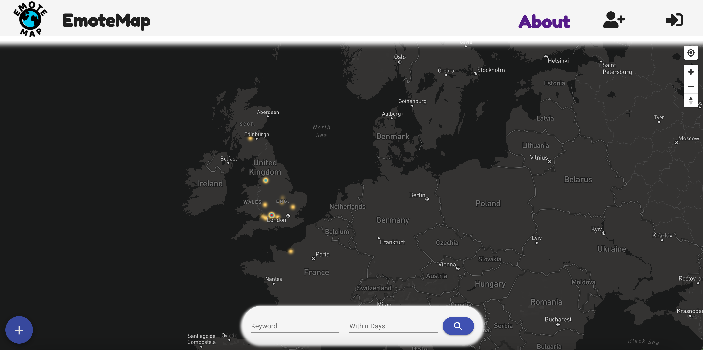

## Table of contents
* [Section1](#section1)
* [Section2](#section2)
* [Section3](#section3)

## Section1
Title : EmoteMap  

What is the serious element?
Addressing the global epidemic of mental health issues. We will highlight the scale of the problem, and encourage solidarity (i.e., by reading other user posts reporting similar emotions and reasoning). By reporting a mood, coupled with a phrase of reason, the above will be achieved. Users can also scan a globe to expose situations happening in other areas, potentially providing an insight to the cause and effect of mental health/low mood - e.g. showing the sentiment in an area changing as the result of an event such as COVID lockdown measures.
1- allows user to reflect on their individual experiences (personal diary)
2- allows users to communicate with each other on shared experiences (social media)
3 – allows for a general sense of cause and effect of mental health to be understood by (heat map)
Age group:  
14+  
## Section2
How does project integrate play?
Interactive way of posting. Users can drop an emotion (e.g. happiness scale 1-10) on the globe, and write a short phrase as to why they feel this. Keywords from the phrase will be detected and used to report locations with similar emotions for similar reasons (e.g.happiness 2/10 due to ‘lockdown’). Users can also search by keyword. The site will also offer a log for each user. The visual element of the ‘mood’ heatmap element also creates an ‘at-a-glance' level of interaction to convey the scale. On top of this, there is the potential for users to interact and communicate with each other, perhaps based on shared experiences/feelings.

## Section3
What are you going to make?
(what features will your project have/technical challenges)
An interface of the globe, with the option for the user to enter their emotional state/happiness level, a keyword phrase describing why they are feeling the way they are, and an optional section for a more detailed blog/diary post. The page will then display (perhaps using a heatmap?) the different mood levels across the globe (or maybe initially localised to Bristol), with the option to click on an area and see the most common keywords to provide insight as to why the sentiment is at the current level (and to see individual blog posts) - perhaps almost creating the basis of a social media type system?
To keep the individual interested, whenever they make a submission, they receive feedback on the number of others who are feeling similar who have submitted the same/similar keyword(s).
As an extension could allow to search for key terms?
(are we using external API/database?)
Api for user location tracking?
We can use an api to display the globe. Will need a database to store user profile data, user posts, and stats about certain key words/happy distribution.  
(is it mobile/desktop?)
Desktop

Demo Map layout idea

